# Deep Learning Final Project: Prohibited Item Detection

See the full documentation [here](./README.pdf).

## 1. ชื่อหัวข้อโครงงาน

ชื่อภาษาไทย: การตรวจจับวัตถุต้องห้ามในภาพเอกซเรย์โดยใช้โมเดล YOLOv11

ชื่อภาษาอังกฤษ: X-ray Prohibited Item Detection Using YOLOv11  

## 2. ความน่าสนใจของหัวข้อ

ที่เลือกหัวข้อนี้เพราะเป็นปัญหาที่มีความสำคัญในการใช้งานจริง
และเกี่ยวข้องกับความปลอดภัยสาธารณะ โดยตรง เช่น การตรวจจับวัตถุต้องห้ามในสนามบิน
หรือในระบบรักษาความปลอดภัย ซึ่งความน่าสนใจของโปรเจคนี้คือ

1.  มีความยากในการทำข้อมูล: จากตัวอย่างภาพ X-ray วัตถุต้องห้ามมักจะปะปน
    (cluttered) กับวัตถุอื่นๆ และมีการซ้อนทับกัน (occlusion)
    ทำให้การตรวจจับด้วยสายตามนุษย์หรือวิธีดั้งเดิมทำได้ยาก

    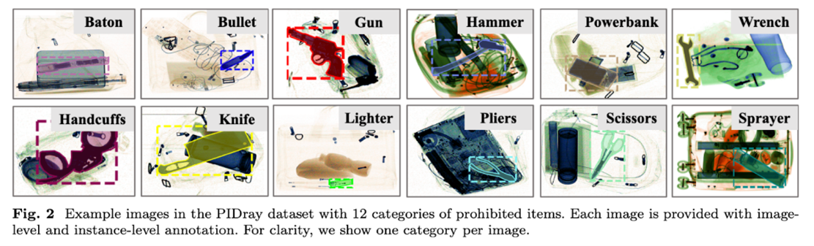

1.  เป็นโอกาสในการนำโมเดล Object Detection ที่เป็น State-of-the-Art (SOTA)
    อย่าง YOLO มาประยุกต์ใช้กับปัญหาที่ซับซ้อน

2.  มีการสร้างระบบ End-to-End: project นี้ไม่ได้มีแค่การ train โมเดล
    แต่เราได้สร้างระบบที่ครบวงจร (end-to-end system) ตั้งแต่การ train model,
    การสร้าง Backend API ไปจนถึง Frontend ให้ผู้ใช้ป้อนภาพและแสดงผลลัพธ์
    (bounding boxes, label, confidence)


*ภาพตัวอย่างเว็บแอพพลิเคชั่น (<https://x-ray-detection.vercel.app/>)*

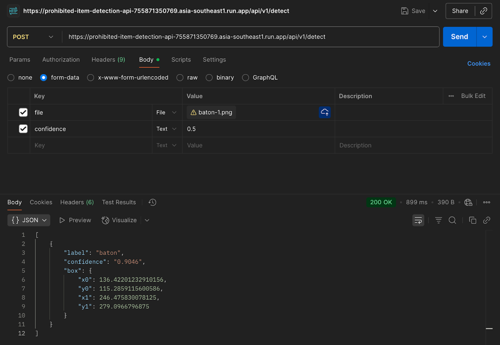

**cURL**
```bash
curl --location 'localhost/api/v1/detect'
--form 'file=@"/path/to/file.jpeg"'
--form 'confidence="0.5"'
```

## 3. Deep Learning ในการแก้ปัญหาหัวข้อนี้

เพราะ การตรวจจับวัตถุในภาพ X-ray มีความซับซ้อนที่วิธี Computer Vision (CV)
แบบดั้งเดิม จัดการได้ยาก

- Traditional CV: วิธีอย่าง Template Matching หรือการใช้ Feature Descriptors
  (เช่น SIFT, SURF) จะทำงานได้ไม่ดีเมื่อวัตถุมีการหมุน (rotation), เปลี่ยนขนาด
  (scale), หรือถูกซ้อนทับ (occlusion) นอกจากนี้ ยังต้องการการทำ Feature
  Engineering ด้วยมือ ซึ่งแทบเป็นไปไม่ได้หรือไม่คุ้มที่จะทำในภาพ X-ray
  เพราะมีรูปภาพจำนวนมาก

- Convolutional Neural Network (CNN): ที่เป็น concept หลักของ YOLO
  ถูกออกแบบมาเพื่อเรียนรู้ features ที่ซับซ้อนเหล่านี้โดยอัตโนมัติ (Automatic Feature
  Extraction) จากข้อมูลจำนวนมาก มันจึงทนทาน (robust) ต่อความแปรปรวนต่าง ๆ
  ในภาพได้ดีกว่า

ข้อเด่นของ Deep Learning (YOLO) ในงานนี้:

1.  Accuracy & Robustness: สามารถเรียนรู้ feature ที่ซับซ้อนของวัตถุต้องห้าม 12
    classes (เช่น \'gun\', \'knife\', \'lighter\') แม้จะมีการซ้อนทับ

2.  Performance: YOLO เป็นโมเดลแบบ One-Stage Detector ที่ขึ้นชื่อเรื่องความเร็วสูง
    (real-time performance)
    ซึ่งจำเป็นอย่างยิ่งสำหรับงานที่ต้องการการตัดสินใจที่รวดเร็วอย่างจุดตรวจความปลอดภัย

ข้อด้อย:

1.  ต้องการข้อมูลจำนวนมากในการ train (ซึ่งเรามี dataset ขนาดใหญ่ถึง 35,000
    ภาพสำหรับ train)

2.  ใช้ทรัพยากรในการคำนวณสูง

3.  เป็นเหมือน black box อธิบายได้ยากว่าทำไมโมเดลถึงตัดสินใจแบบนั้น

## 4. สถาปัตยกรรม Deep Learning ที่ใช้

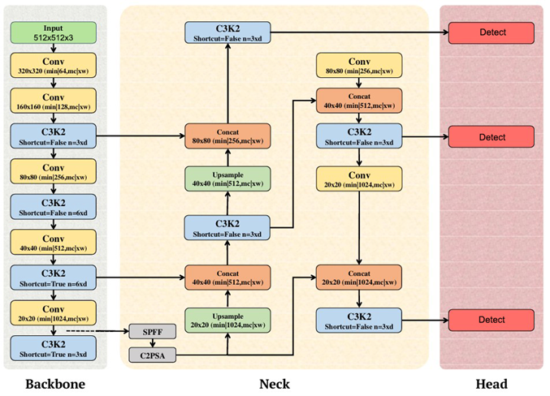

ในโครงงานนี้ได้ใช้โมเดล YOLOv11s ซึ่งเป็นโมเดลประเภท Convolutional Neural
Network (CNN) สำหรับงาน Object Detection โดยมีโครงสร้างหลักแบ่งออกเป็น 3 ส่วน
ดังนี้

1\. Backbone: เป็นส่วนของเครือข่ายที่ทำหน้าที่สกัดคุณลักษณะ (Feature Extraction)
จากภาพอินพุต โดยผ่านการประมวลผลด้วย convolutional layers หลายชั้น
เพื่อแยกแยะลักษณะของวัตถุในระดับต่าง ๆ เช่น ขอบ สี และรูปทรง

2\. Neck: ทำหน้าที่รวมและปรับสมดุลข้อมูลจากหลายระดับของ Backbone (Multi-scale
Feature Fusion) โดยใช้โครงสร้างแบบ PANet (Path Aggregation Network)
เพื่อให้โมเดลสามารถตรวจจับวัตถุได้ทั้งขนาดเล็กและขนาดใหญ่ได้อย่างมีประสิทธิภาพ

3\. Head: เป็นส่วนสุดท้ายของโมเดล ใช้ feature maps ที่ได้จาก Neck
มาทำนายผลลัพธ์ของการตรวจจับ ซึ่งประกอบด้วย

- Bounding Boxes (box_loss): พิกัดของกรอบวัตถุที่ตรวจพบ

- Class Probabilities (cls_loss): ความน่าจะเป็นของแต่ละคลาส เช่น gun (90%)
  หรือ knife (5%)

- Objectness Score: ค่าความมั่นใจว่าในกรอบนั้นมีวัตถุจริง ๆ

จากการดูสรุปสถาปัตยกรรมของโมเดลในไฟล์ฝึกสอน (`train.ipynb`) พบว่า YOLOv11s
ที่ใช้ในงานนี้มีทั้งหมด 181 layers และมีจำนวนพารามิเตอร์รวม 9,432,436 ค่า
ซึ่งครอบคลุมทั้ง Weights และ Biases ของทุกชั้นในเครือข่าย

สำหรับฟังก์ชันกระตุ้น (Activation Function) โมเดล YOLOv11s ใช้ SiLU (Sigmoid
Linear Unit) เป็นฟังก์ชันหลัก
เนื่องจากมีความสามารถในการรักษาข้อมูลเชิงเส้นและไม่เชิงเส้นได้ดี
ช่วยให้โมเดลเรียนรู้ฟีเจอร์ได้อย่างราบรื่นและมีเสถียรภาพมากกว่า ReLU ในเวอร์ชันก่อนหน้า

## 5. อธิบายโค้ดที่ใช้ในโครงงงาน

### 5.1 เตรียมชุดข้อมูล (`dataset.ipynb`)

#### 5.1.1. การโหลดและจัดโครงสร้างข้อมูล

เริ่มจากอ่านไฟล์ train.json และ test.json ซึ่งอยู่ในรูปแบบ COCO (มี key: images,
annotations, categories) จากนั้นใช้ฟังก์ชัน `get_dataset_annotations()`
เพื่อรวมข้อมูลภาพและ annotation ของแต่ละภาพเข้าด้วยกันให้อยู่ในรูปแบบที่เข้าถึงได้ง่าย เช่น

```py
dataset[image_id] = { "image": {filename, width, height}, "objects": [{class_id, bbox}, ...] }
```

ทำให้สามารถเรียกดูข้อมูลของแต่ละภาพและกรอบวัตถุได้โดยตรง

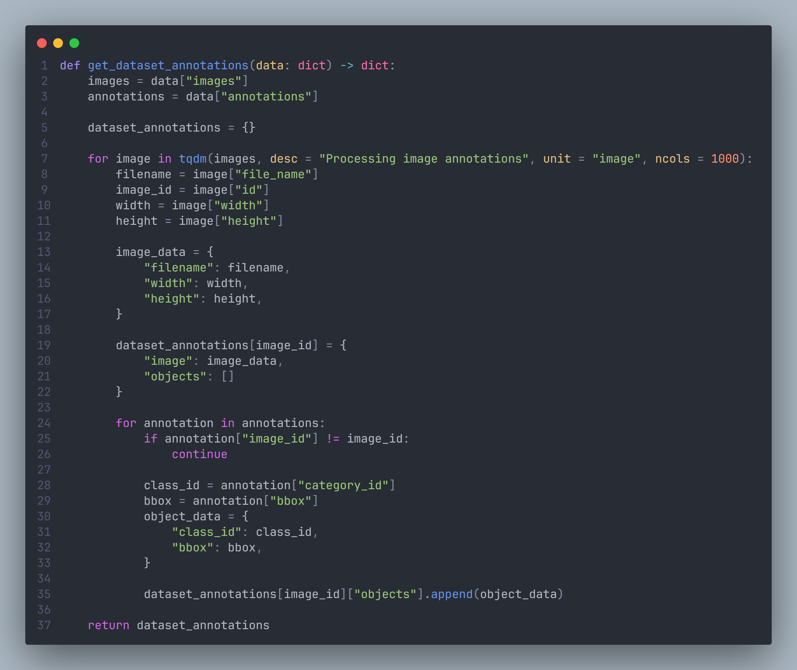

#### 5.1.2. การสำรวจและสรุปข้อมูลเบื้องต้น

ใช้ฟังก์ชัน `get_dataset_information()` เพื่อสรุปจำนวนภาพทั้งหมด จำนวนกรอบวัตถุ และจำนวนภาพที่ไม่มี annotation นอกจากนี้ยังมี
`get_class_distribution()` สำหรับนับจำนวนและสัดส่วนของแต่ละคลาส เพื่อประเมินความสมดุลของข้อมูล

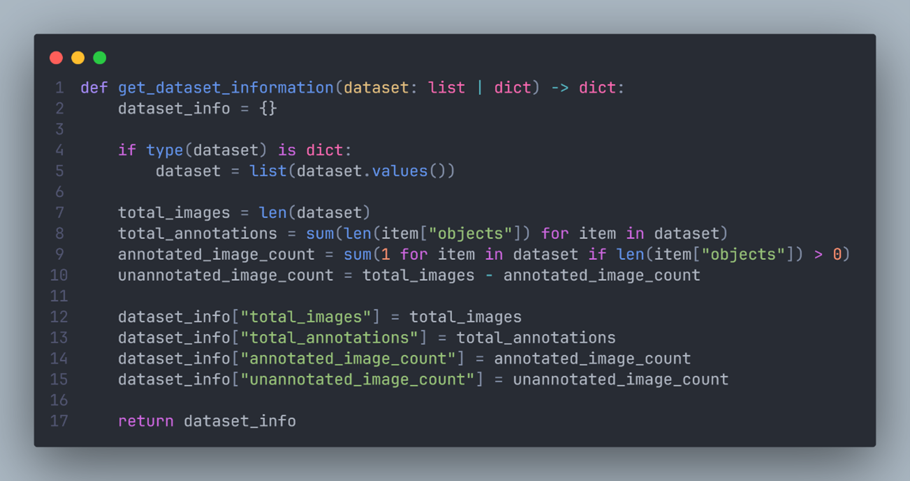

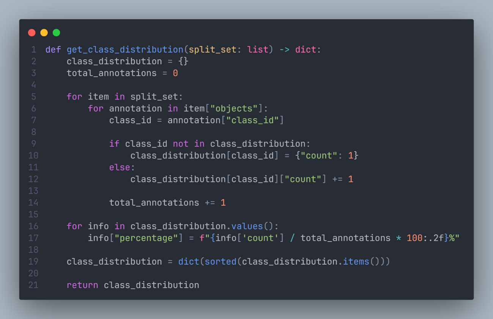

#### 5.1.3. การแบ่งชุดข้อมูล

ทำการแบ่งชุดข้อมูลออกเป็น Training / Validation / Testing ดังนี้

- ฟังก์ชัน `undersample()` ใช้เพื่อลดจำนวนภาพที่ไม่มีวัตถุ (กำหนด null_ratio=0.3)
  เพื่อบาลานซ์ข้อมูล

- ฟังก์ชัน `split_dataset()` แบ่งชุดข้อมูลฝึกออกเป็น Train 35,000 ภาพ และ
  Validation 5,000 ภาพ

- ชุด Testing ถูกสุ่มเลือกมา 5,000 ภาพ

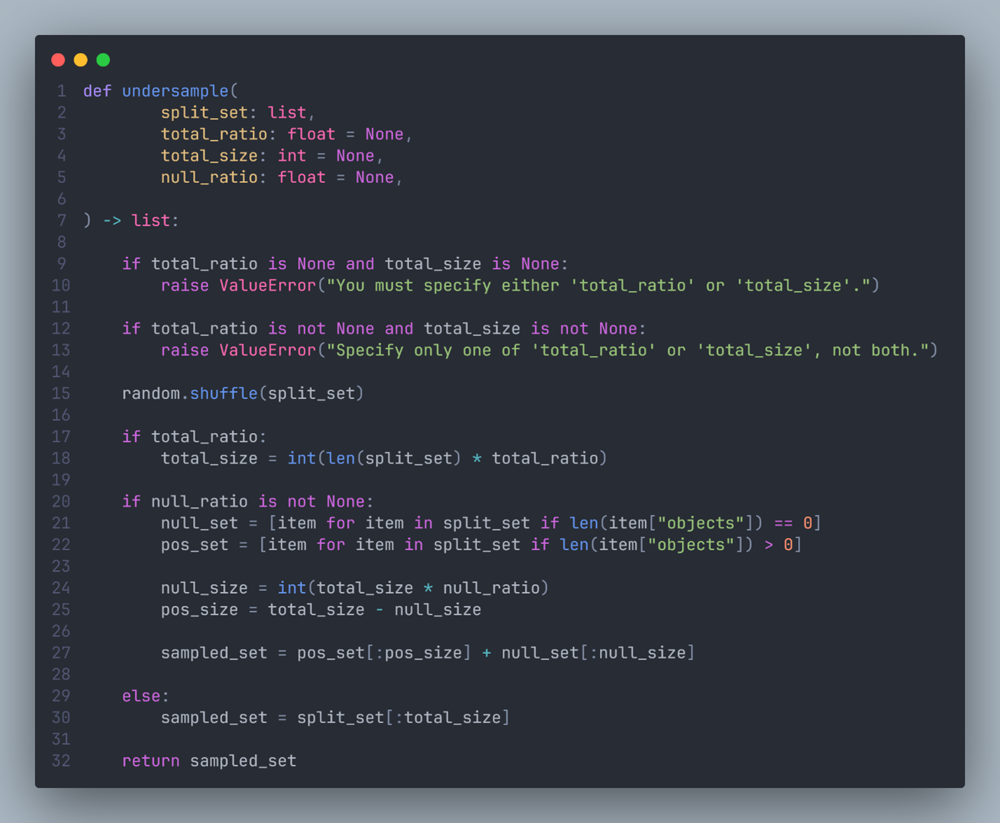

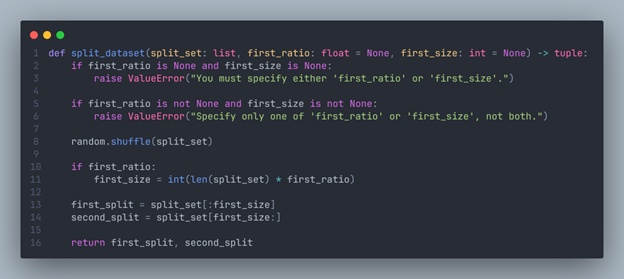

#### 5.1.4. การแปลง Bounding Box ให้อยู่ในรูปแบบ YOLO

ฟังก์ชัน `normalize_bbox()` ทำการแปลงพิกัดจาก COCO \[x_min, y_min, width,
height\]

ให้เป็นรูปแบบ YOLO \<class_id\> \<x_center_norm\> \<y_center_norm\>
\<w_norm\> \<h_norm\>

โดย normalize ค่าให้อยู่ระหว่าง 0--1 ตามขนาดภาพ

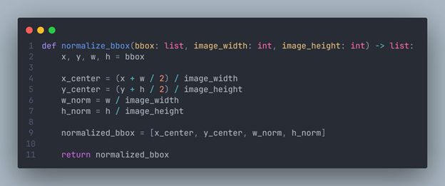

#### 5.1.5. การสร้างโฟลเดอร์ Dataset สำหรับ YOLO

ใช้ฟังก์ชัน `create_dataset()` เพื่อสร้างโครงสร้างโฟลเดอร์และไฟล์สำหรับเทรนโมเดล
YOLO ได้แก่

```plaintext
dataset/
├─ images/
│  ├─ train/
│  ├─ val/
│  └─ test/
└─ labels/
   ├─ train/
   ├─ val/
   └─ test/
```

ในแต่ละภาพจะมีไฟล์ .txt ที่เก็บ annotation ในรูปแบบ YOLO
พร้อมใช้งานกับ Ultralytics ได้ทันที

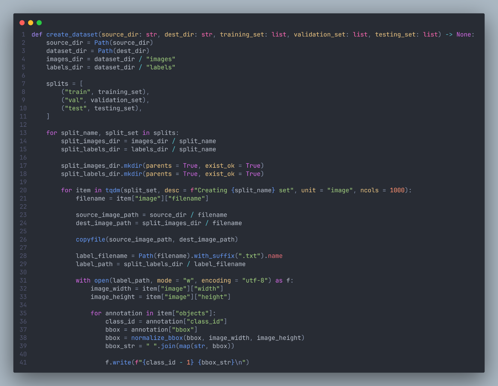

#### 5.1.6 การเปลี่ยนชื่อไฟล์ (Rename)

สุดท้ายใช้ฟังก์ชัน `rename_files()` เพื่อเปลี่ยนชื่อไฟล์ตามระดับความยาก เช่น xray_easy_00001.png,
xray_hard_00002.png, xray_hidden_00003.png เพื่อให้ง่ายต่อการอ้างอิงและวิเคราะห์ภายหลัง

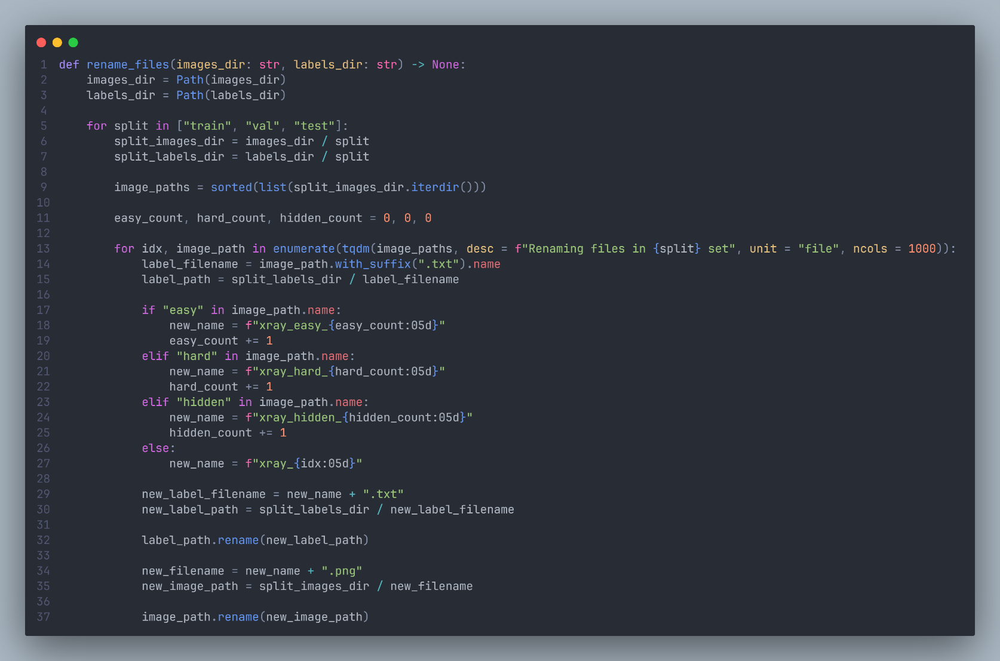

### 5.2 การฝึกโมเดล (`train.ipynb`)

#### 5.2.1 การติดตั้งและนำเข้าไลบรารี

เริ่มจากติดตั้งไลบรารี Ultralytics ซึ่งเป็นเฟรมเวิร์กสำหรับการใช้งาน YOLO จากนั้น
import ไลบรารีพื้นฐานที่จำเป็น เช่น cv2, matplotlib, และ pathlib.Path
เพื่อใช้แสดงผลและจัดการพาธไฟล์ รวมถึงมีการ mount Google Drive เพื่อนำ dataset
มาใช้ฝึกโมเดล และเก็บผลลัพธ์ของการเทรนโมเดลในภายหลัง

#### 5.2.2 การกำหนดพาธข้อมูล (`data.yaml`)

ไฟล์ `data.yaml` ช่วยให้โมเดลรู้ตำแหน่งของข้อมูลสำหรับการฝึก ตรวจสอบ
และทดสอบอย่างเป็นระบบโดยใช้เพื่อระบุพาธของชุดข้อมูลและชื่อคลาสทั้งหมด 12 คลาส ดังนี้

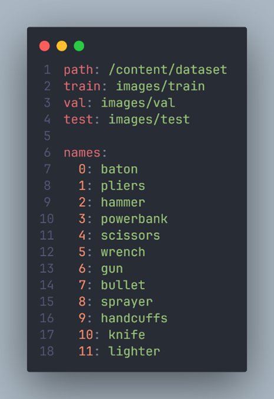

#### 5.2.3 การโหลดโมเดลเริ่มต้น (Pretrained Model)

โหลดโมเดล YOLOv11s ที่ผ่านการฝึกบน dataset
COCO มาก่อนแล้ว จากนั้นนำมาทำ Fine-tuning กับชุดข้อมูล X-ray ที่จัดเตรียมไว้

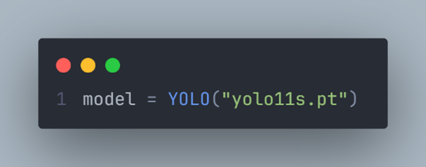

#### 5.2.4 การตั้งค่าการฝึกสอน (Training Parameters)

กำหนดค่าพารามิเตอร์หลักที่ใช้ในการฝึก เช่น จำนวนรอบการฝึก (epochs), ขนาดภาพ (image
size), การใช้ early stopping (patience), และการเปิดใช้ cosine learning rate
schedule เพื่อปรับค่าเรียนรู้อย่างต่อเนื่อง นอกจากนี้ยังมีการเปิดใช้ data augmentation
เช่น การกลับภาพ (flip), mosaic, และ mixup
เพื่อเพิ่มความหลากหลายของข้อมูลและช่วยลดการ overfitting ของโมเดล

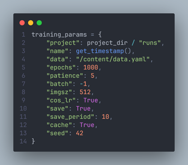

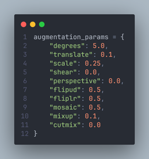

#### 5.2.5 การเริ่มฝึกโมเดล (Training Process)

เริ่มฝึกสอนโมเดล YOLOv11s โดยจะโหลดน้ำหนักจาก pretrained model
จากนั้นปรับจำนวนคลาสเป็น 12 คลาส และเริ่มทำการ fine-tune ตามชุดข้อมูลที่กำหนด
ระหว่างการฝึก โมเดลจะบันทึกผลลัพธ์และค่าประสิทธิภาพในแต่ละ epoch ไว้ในโฟลเดอร์ runs/

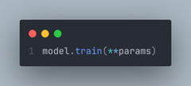

#### 5.2.6 ผลลัพธ์หลังการฝึกสอน

หลังการฝึกสอนเสร็จสิ้น จะได้ไฟล์น้ำหนักโมเดลและค่าประเมินประสิทธิภาพ ได้แก่

- best.pt (โมเดลที่มีประสิทธิภาพสูงสุด) และ last.pt (โมเดลล่าสุด)

- เมตริกสรุปผล เช่น Precision, Recall, mAP@50, และ mAP@50--95

- กราฟแสดงค่า loss และ precision--recall curve เพื่อวิเคราะห์ผลการฝึก

### 5.3 การประเมิลผลโมเดล (`evaluate.ipynb`)

#### 5.3.1 การแปลงและโหลดโมเดล

หลังการฝึกสอน โมเดลถูกแปลงเป็น ONNX format เพื่อให้ inference
ได้รวดเร็วและรองรับการรันข้ามแพลตฟอร์ม จากนั้นโหลดกลับมาทดสอบด้วย

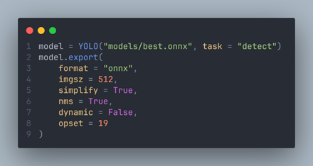

#### 5.3.2 การประเมินเชิงภาพ (Qualitative Evaluation)

โมเดลถูกนำมาทดสอบกับชุดภาพจาก dataset/images/test โดยใช้คลาส
ProhibitedDetector เพื่อพยากรณ์ตำแหน่งและคลาสของวัตถุ

ผลลัพธ์แต่ละภาพจะแสดง bounding box, label, และ confidence score
เพื่อให้ตรวจสอบความถูกต้องเชิงสายตา เช่น hammer, lighter, pliers, gun เป็นต้น

#### 5.3.3 การจัดชุดทดสอบตามระดับความยาก

ข้อมูลทดสอบถูกแยกเป็น 3 กลุ่ม
เพื่อให้สามารถประเมินความสามารถของโมเดลในแต่ละเงื่อนไขได้อย่างละเอียด โดยแบ่งได้ดังนี้

- Easy: มีวัตถุต้องห้ามเพียงหนึ่งชิ้นในภาพ

- Hard: มีวัตถุต้องห้ามหลายชิ้นในภาพเดียว

- Hidden: มีวัตถุต้องห้ามที่ถูกซ่อนหรือดัดแปลงรูปร่างให้ตรวจจับได้ยาก

#### 5.3.4 การประเมินเชิงปริมาณ (Quantitative Evaluation)

วัดประสิทธิภาพของโมเดลในแต่ละชุดทดสอบ (easy, hard, hidden และ overall)
โดยผลลัพธ์ถูกจัดสรุปออกเป็น 2 ตารางหลัก คือ

1.  ตารางระดับชุดข้อมูล (Dataset-level): สรุปภาพรวมของแต่ละ subset เช่น
    จำนวนภาพ, จำนวนวัตถุ (instances), และค่าเมตริกสำคัญ ได้แก่ mAP@50, mAP@75,
    และ mAP@50--95 ซึ่งใช้วัดความแม่นยำโดยรวมของโมเดลในแต่ละระดับความยาก

2.  ตารางระดับคลาส (Class-level): แสดงผลลัพธ์แยกตามวัตถุทั้ง 12 คลาส โดยมีค่า
    Precision, Recall, F1-score, mAP50, และ mAP50--95
    เพื่อประเมินว่าโมเดลสามารถตรวจจับวัตถุแต่ละประเภทได้ดีเพียงใด

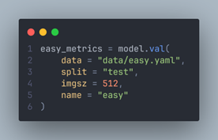

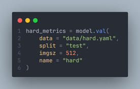

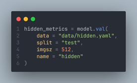


## 6. ลิงค์ไปยัง Repository

พัฒนาโมเดล: <https://github.com/chavalvit-k/prohibited-item-detection>

Backend:
<https://gitlab.com/chavalvit.keart/prohibited-item-detection-api>

Frontend: <https://github.com/Lucky-TP/X-ray-Prohibited-Item-Detection>

## 7. อธิบายการฝึกโมเดล

ในการฝึกสอนโมเดล โครงงานนี้ใช้แนวทาง Transfer Learning (Fine-tuning)
แทนการเทรนจากศูนย์ (from scratch) โดยเริ่มจากโมเดล YOLOv11s
ที่ผ่านการฝึกมาก่อนบนชุดข้อมูล COCO Dataset ซึ่งมีวัตถุ 80 คลาส
โมเดลนี้จึงมีพื้นฐานความเข้าใจเกี่ยวกับรูปร่าง ขอบเขต และลักษณะทั่วไปของวัตถุอยู่แล้ว
จากนั้นเรานำมาปรับเพิ่มเติม (fine-tune) ให้จำแนกเฉพาะ 12 คลาสของวัตถุต้องห้ามในภาพ
X-ray

ก่อนจะเริ่มกระบวนการฝึกสอนโมเดล เราจำเป็นต้องมีการตั้งค่า Hyperparameters
เพื่อกำหนดทิศทางและลักษณะการเรียนรู้ของโมเดล เช่น จะเรียนรู้เร็วแค่ไหน เรียนกี่รอบ
หรือจะเพิ่มความหลากหลายของข้อมูลอย่างไร เพราะโมเดล deep learning
ไม่สามารถตัดสินใจสิ่งเหล่านี้ได้ด้วยตัวเอง หากตั้งค่าไม่เหมาะสม เช่น learning rate
สูงเกินไป อาจทำให้โมเดลเรียนรู้ผิดพลาดหรือไม่เสถียร ในทางกลับกัน
หากตั้งค่าต่ำเกินไปหรือรอบฝึกน้อยเกินไป โมเดลอาจไม่สามารถเรียนรู้ได้เต็มที่

นอกจากพารามิเตอร์ที่ควบคุมการฝึกโดยตรงแล้ว ยังมีส่วนของ augmentation parameters
ที่ใช้ในการปรับแต่งข้อมูลก่อนส่งเข้าโมเดล เช่น การหมุน การกลับภาพ การซ้อนภาพหลายใบ
(mosaic) หรือการผสมภาพ (mixup) ซึ่งช่วยให้ข้อมูลฝึกมีความหลากหลายมากขึ้น
ทำให้โมเดลเรียนรู้ได้ robust และสามารถ generalize ได้ดีขึ้นกับภาพที่ไม่เคยเห็นมาก่อน
การกำหนด hyperparameters ทั้งสองส่วนนี้จึงเป็นเหมือน "กติกาในการเรียนรู้"
ที่ช่วยให้โมเดลสามารถปรับน้ำหนักได้อย่างมีประสิทธิภาพ
และให้ผลลัพธ์ที่แม่นยำสูงสุดในการตรวจจับวัตถุในภาพ X-ray

| **ชื่อพารามิเตอร์** | **ค่าที่ใช้** | **คำอธิบาย**                                                                                                                                                                                |
|-----------------|-----------|--------------------------------------------------------------------------------------------------------------------------------------------------------------------------------------------|
| epochs          | 1000      | จำนวนรอบสูงสุดของการฝึก เพื่อให้โมเดลได้เรียนรู้ครบทุกข้อมูล โดยมี Early Stopping ช่วยหยุดอัตโนมัติเมื่อผลไม่ดีขึ้น                                                                                                 |
| patience        | 5         | จำนวนรอบที่อนุญาตให้ performance ไม่ดีขึ้นก่อนหยุดการฝึก ป้องกัน overfitting และประหยัดเวลา                                                                                                              |
| imgsz           | 512       | ขนาดภาพที่ใช้ระหว่างการฝึก (512×512 px) ใกล้เคียงกับความละเอียดเฉลี่ยของภาพในชุดข้อมูล PIDray (≈500×500 px) และเป็นค่าที่หารด้วย 32 ลงตัวตามโครงสร้างของ YOLO ทำให้รักษารายละเอียดของวัตถุได้ดีและประมวลผลได้มีประสิทธิภาพ |
| batch           | -1        | ให้ Ultralytics คำนวณ batch size อัตโนมัติตามหน่วยความจำของ GPU เพื่อใช้ทรัพยากรได้เต็มประสิทธิภาพ                                                                                                      |
| cos_lr          | True      | เปิดใช้ Cosine Learning Rate Schedule เพื่อให้ learning rate ลดลงอย่างราบรื่น ช่วยให้โมเดลเสถียรในช่วงท้ายของการฝึก                                                                                      |
| seed            | 42        | กำหนดค่า seed สำหรับการสุ่ม เพื่อให้สามารถทำซ้ำผลลัพธ์ได้อย่างสม่ำเสมอ                                                                                                                                  |
| flipud / fliplr | 0.5       | กลับภาพในแนวตั้งและแนวนอนครึ่งหนึ่งของข้อมูล เพื่อให้โมเดลเข้าใจมุมมองที่หลากหลาย                                                                                                                          |
| mosaic          | 0.5       | รวมภาพ 4 ภาพเข้าด้วยกัน เพิ่มความหลากหลายของฉากและการซ้อนทับวัตถุ เหมาะกับงานตรวจจับวัตถุหลายชิ้น                                                                                                         |
| mixup           | 0.1       | ผสมภาพสองภาพเข้าด้วยกัน เพื่อช่วยให้โมเดล generalize ได้ดีขึ้นและลดการ overfitting                                                                                                                    |
| degrees         | 5.0       | หมุนภาพในช่วง ±5 องศา เพื่อจำลองความหลากหลายของมุมมองในสภาพจริง                                                                                                                                  |
| translate       | 0.1       | ขยับภาพเล็กน้อยในแนวแกน X/Y เพื่อเพิ่มความทนทานต่อการเคลื่อนตำแหน่งของวัตถุ                                                                                                                             |
| scale           | 0.25      | ปรับขนาดวัตถุแบบสุ่มในช่วง ±25% เพื่อให้โมเดลเข้าใจวัตถุหลายขนาด                                                                                                                                       |

## 8. อธิบายชุดข้อมูล

PIDray dataset: https://bit.ly/3X7xdMW

YOLOv11 dataset: https://bit.ly/3WzniQ6

ในโครงงานนี้ได้ใช้ชุดข้อมูล PIDray (Prohibited Item Detection Dataset)
ซึ่งเป็นชุดข้อมูลมาตรฐานสำหรับการตรวจจับวัตถุต้องห้ามในภาพ X-ray โดยจัดทำโดยทีมวิจัยจาก
Tsinghua University  
ชุดข้อมูลนี้มีภาพ X-ray รวมทั้งหมด 124,486 ภาพ แบ่งออกเป็นชุด Training 76,913 ภาพ
และ Testing 47,573 ภาพ ซึ่งในส่วนของ Testing ยังแบ่งย่อยตามระดับความยากเป็น 3
กลุ่ม คือ

- Easy: ภาพที่มีวัตถุต้องห้ามเพียงชิ้นเดียว

- Hard: ภาพที่มีวัตถุต้องห้ามหลายชิ้น

- Hidden: ภาพที่มีวัตถุต้องห้ามที่ถูกซ่อนหรือบังอยู่บางส่วน

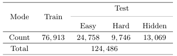

แต่เนื่องจากชุดข้อมูลเต็มมีขนาดใหญ่มาก (กว่า 120,000 ภาพ)
อาจทำให้ใช้เวลาในการฝึกโมเดลที่นานมาก และอาจเกินขีดจำกัดของหน่วยความจำ GPU
ที่ใช้ในการฝึกสอนโมเดล ดังนั้นในการเทรนจริงจึงได้ทำการ สุ่มตัวอย่าง (sampling)
ลดขนาดลงมาเหลือ 40,000 ภาพ โดยยังคงสัดส่วนของแต่ละกลุ่ม (easy, hard, hidden)
ให้ใกล้เคียงกับต้นฉบับ เพื่อให้ได้ทั้งความสมดุลและประสิทธิภาพในการฝึก

นอกจากนี้ ในชุดข้อมูล ยังประกอบด้วย 12 คลาสของวัตถุต้องห้าม ได้แก่  
baton, pliers, hammer, powerbank, scissors, wrench, gun, bullet,
sprayer, handcuffs, knife, lighter  
โดยมีการกระจายของจำนวนวัตถุในแต่ละคลาสแตกต่างกันดังกราฟด้านล่าง
ซึ่งแสดงให้เห็นถึงความไม่สมดุลของคลาส (class imbalance) --- เช่น "powerbank" และ
"scissors" มีจำนวนมากกว่า "baton" หรือ "bullet" อย่างมีนัยสำคัญ

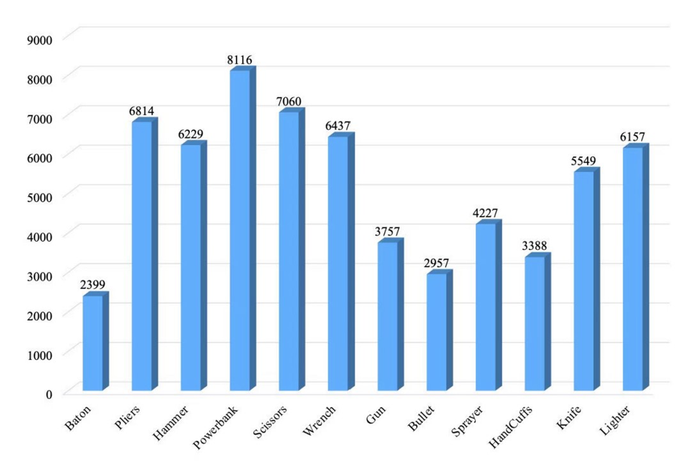

ก่อนนำข้อมูลมาใช้ ได้มีการแปลง annotation จากรูปแบบ COCO (\[x_min, y_min,
width, height\]) ให้อยู่ในรูปแบบ YOLO format (\<class_id\> \<x_center\>
\<y_center\> \<width\> \<height\>) เพื่อให้เข้ากับโมเดล YOLOv11s
จากนั้นจึงแบ่งข้อมูลออกเป็น Training / Validation / Test sets และทำ
undersampling บางส่วนของภาพที่ไม่มีวัตถุ
เพื่อเพิ่มความสมดุลของข้อมูลและลดเวลาในการประมวลผล

โดยสรุป ชุดข้อมูล PIDray มีจุดเด่นคือความใกล้เคียงกับสภาพแวดล้อมจริงในสนามบินและสถานีขนส่ง ความหลากหลายของฉาก
และระดับความยากที่ท้าทาย ซึ่งเหมาะสำหรับใช้ประเมินความสามารถของโมเดลตรวจจับวัตถุ
(Object Detection) อย่าง YOLOv11s ได้อย่างครอบคลุม

## 9. อธิบายการประเมินผลโมเดล

### 9.1 การประเมินเชิงคุณภาพ (Qualitative Evaluation)

การประเมินเชิงคุณภาพทำโดยการสุ่มภาพจากชุด Test Set มาทดลองทำนายผล ซึ่งจะแสดง
bounding box และชื่อคลาสของวัตถุที่ตรวจพบพร้อมค่าความมั่นใจ (confidence score)
ดังภาพด้านล่าง

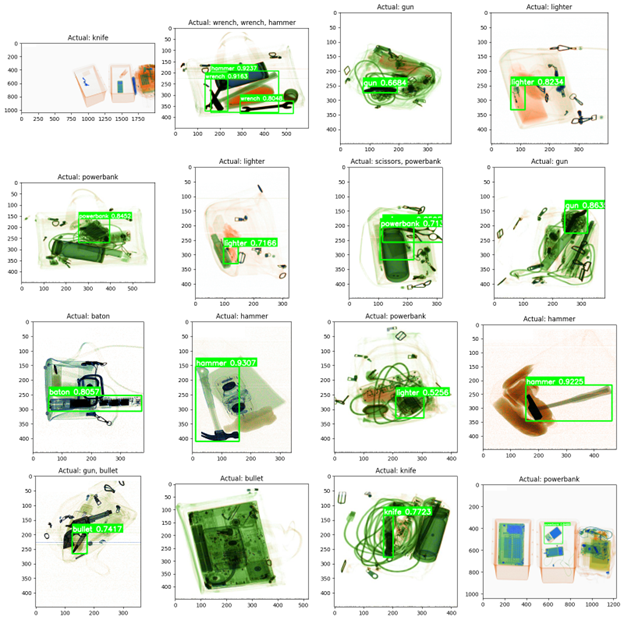

จากภาพจะเห็นว่าโมเดลสามารถตรวจจับวัตถุได้อย่างถูกต้องและแม่นยำเป็นส่วนใหญ่ แม้ในกรณีที่วัตถุมีการซ้อนทับหรือมีสิ่งของอื่นบดบังบางส่วนก็ตาม

### 9.2 การประเมินเชิงปริมาณ (Quantitative Evaluation) 

ในส่วนนี้ได้ทำการประเมินผลโดยใช้ Mean Average Precision (mAP) ซึ่งเป็น metric
มาตรฐานในงาน Object Detection

- mAP50หมายถึงค่าเฉลี่ยของความแม่นยำเมื่อ IoU ≥ 0.5

- mAP50-95 หมายถึงค่าเฉลี่ยของ mAP ที่คำนวณจาก IoU ตั้งแต่ 0.5 ถึง 0.95
  (ช่วงละเอียดกว่าและเข้มงวดกว่า)

#### 9.2.1. ภาพรวมของผลการทดสอบ (Overall Performance)

โมเดลถูกทดสอบกับชุดข้อมูล 4 กลุ่ม ได้แก่ easy, hard, hidden และ overall โดยผลลัพธ์สรุปในตารางด้านล่าง

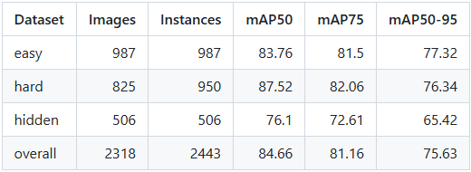

จากตารางจะเห็นว่าโมเดลทำผลงานได้ดีในกลุ่ม easy และ hard โดยมีค่า mAP50 เฉลี่ยอยู่ที่
84.66% และค่า mAP50--95 ที่ 75.63% ขณะที่กลุ่ม hidden
ซึ่งเป็นกรณีที่วัตถุถูกซ่อนหรือบังบางส่วน มีความยากสูง จึงได้ค่าความแม่นยำต่ำกว่าที่ประมาณ 65.4%

#### 9.2.2 ประสิทธิภาพรายคลาส (Per-Class Performance)

เพื่อวิเคราะห์ความสามารถของโมเดลในแต่ละประเภทของวัตถุต้องห้าม ได้มีการคำนวณ
Precision, Recall, F1-score และค่า mAP แยกตามคลาส ดังตารางด้านล่าง

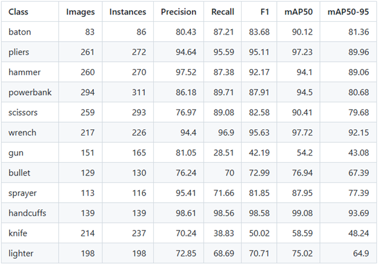

ผลลัพธ์แสดงให้เห็นว่าโมเดลสามารถตรวจจับคลาสที่มีลักษณะชัดเจน เช่น handcuffs, pliers,
wrench ได้ดีมาก โดยมีค่า Precision และ Recall มากกว่า 95%
ในขณะที่คลาสที่มีรูปร่างเล็กหรือมักซ่อนอยู่ในวัตถุอื่น เช่น gun และ knife มีค่า Recall ต่ำกว่า
เนื่องจากการตรวจจับทำได้ยากกว่าในภาพ X-ray

โดยสรุป โมเดล YOLOv11s ที่ผ่านการปรับ fine-tune บน PIDray dataset
แสดงให้เห็นถึงความสามารถในการตรวจจับวัตถุต้องห้ามได้แม่นยำและสอดคล้องกับระดับความยากของข้อมูลจริงในสนามบิน

## 10. บทความอ้างอิงและงานที่เกี่ยวข้อง

### 10.1 ชุดข้อมูลและแนวคิดพื้นฐาน

\[1\] L. Zhang, L. Jiang, R. Ji, H. Fan, "A Large-scale X-ray Benchmark
for Real-World Prohibited Item Detection (PIDray)," *arXiv preprint
arXiv:2211.10763*, 2022.

- Link: https://arxiv.org/pdf/2211.10763

- Reference หลักสำหรับ Dataset (PIDray) ที่เราใช้ train
  และทดสอบโมเดลทั้งหมดในโครงงานนี้

\[2\] J. Redmon, S. Divvala, R. Girshick, and A. Farhadi, "You Only Look
Once: Unified, Real-Time Object Detection," in *Proc. IEEE Conference on
Computer Vision and Pattern Recognition (CVPR)*, 779-788, 2016.

- Link: https://arxiv.org/pdf/1506.02640.pdf

- ใช้อ้างอิงถึงแนวคิดดั้งเดิมของสถาปัตยกรรม YOLO (You Only Look Once)
  ซึ่งเป็นพื้นฐานของโมเดลที่เราเลือกใช้

\[3\] J. Redmon and A. Farhadi, "YOLOv3: An Incremental Improvement,"
*arXiv preprint arXiv:1804.02767*, 2018.

- Link: https://arxiv.org/pdf/1804.02767.pdf

- ใช้อ้างอิงการพัฒนาที่สำคัญของสถาปัตยกรรม YOLO (เช่น การใช้ multi-scale features)
  ซึ่งเป็นแนวคิดที่ถูกนำมาพัฒนาต่อในโมเดล YOLOv11s ที่เราใช้

### 10.2 เฟรมเวิร์ก ไลบรารี และเอกสารอ้างอิง

\[4\] G. Jocher, A. Chaurasia, and J. Qiu, "YOLO by Ultralytics (Version
8.x)," \[Software\], 2023.

- Link: https://github.com/ultralytics/ultralytics

- นี่คือ Library/Framework หลัก (Ultralytics) ที่เราใช้ในการ train และ
  fine-tuning โมเดล YOLOv11s ของเรา (ตามที่ระบุใน `train.ipynb`)

\[5\] Ultralytics, "YOLO Data Augmentation Guide," \[Online
Documentation\], 2024.

- Link: https://docs.ultralytics.com/guides/yolo-data-augmentation/

- ใช้อ้างอิงเทคนิค Data Augmentation (เช่น mosaic, mixup)
  ที่เรากำหนดค่าในaugmentation_params ในไฟล์ `train.ipynb`

\[6\] S. Tiangolo (S. Ramírez), "FastAPI," \[Software\], 2018.

- Link: https://fastapi.tiangolo.com/

- ใช้อ้างอิง FastAPI Framework ที่เราใช้สร้าง Backend API สำหรับการ deploy โมเดล
  (ตามที่ระบุใน Endpoint prohibited-item-detection-api)

\[7\] E. You, et al., "Vite: Next Generation Frontend Tooling,"
\[Software\], 2020.

- Link: https://vitejs.dev/

- ใช้อ้างอิง Vite ซึ่งเป็นเครื่องมือ Frontend build tool ที่เราใช้สำหรับพัฒนา Website
  (x-ray-detection.vercel.app)

## 11. สัดส่วนของงาน

| **หมวดงานหลัก** | **ประเภทงานย่อย**        | **สัดส่วนงาน (%)** | **ผู้รับผิดชอบ** |
|----------------|-------------------------|------------------|--------------|
| พัฒนาโมเดล      | เตรียมชุดข้อมูล             | 10               | ธัญชนก        |
|                | ฝึกโมเดล                 | 10               | ชวัลวิทย์       |
|                | ประเมินประสิทธิภาพของโมเดล | 10               | ชวัลวิทย์       |
| Backend        | ออกแบบ API              | 5                | ชวัลวิทย์       |
|                | พัฒนา Backend            | 20               | ชวัลวิทย์       |
|                | Deployment              | 5                | ชวัลวิทย์       |
| Frontend       | ออกแบบ UX/UI            | 5                | ธัญชนก        |
|                | พัฒนา Frontend           | 20               | ธัญชนก        |
|                | Deployment              | 5                | ธัญชนก        |
| รายงาน         |                         | 10               | ธัญชนก        |
| รวมทั้งหมด       |                         | 100              |              |
